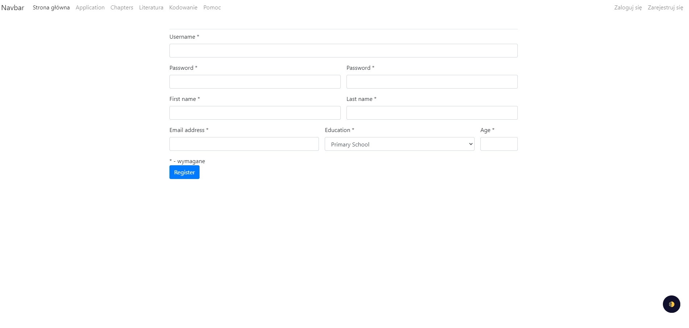
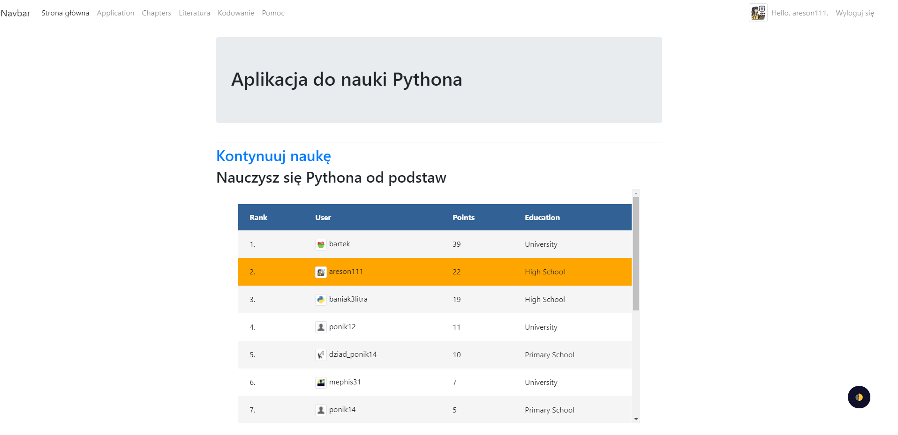
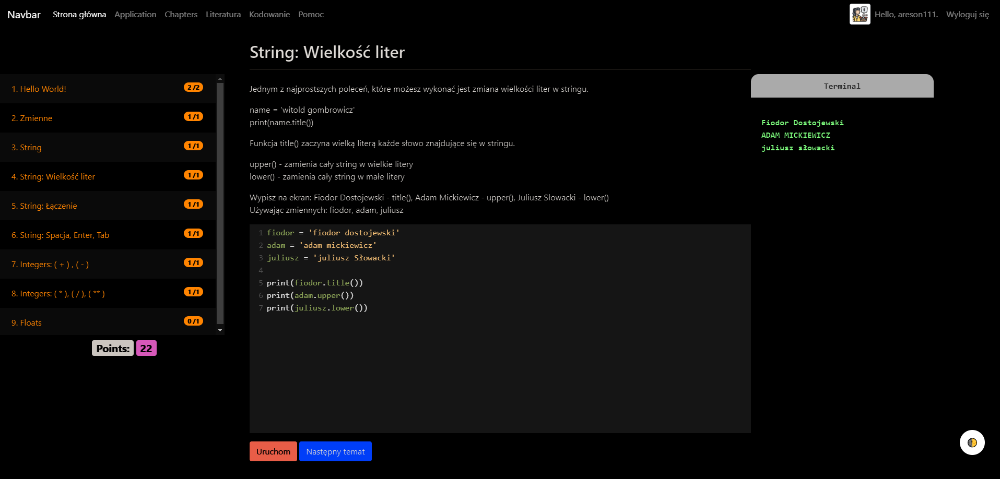
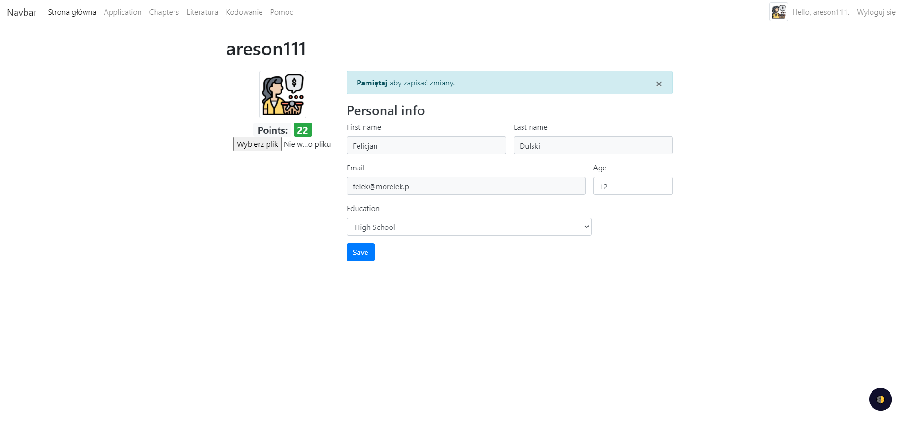

# Aplikacja-do-nauki-Pythona
Aplikacja pisana w Django, HTML i CSS

Aplikacja jest projektem pracy inżynierskiej, umożliwia użytkownikowi naukę Pythona poprzez podzielenie na rozdziały i tematy.

Rejestracja:

Strona główna aplikacji pokazuje ranking użytkowników:

Każdy temat zawiera opis zagadanienia i zadanie do wykonania.
Aplikacja posiada możliwość trybu nocnego.
Aplikacja umożliwia wykonanie się kodu bez potrzeby instalacji Pythona.
Biblioteka CodeMirror pozwala stworzyć miejsce na pisanie kodu uwzględniające wszystkie szczegóły języka(np. tab po if:)
Użytkownik za każde dobrze wykonane zadanie otrzymuje punkty:

Strona użytkownika:

